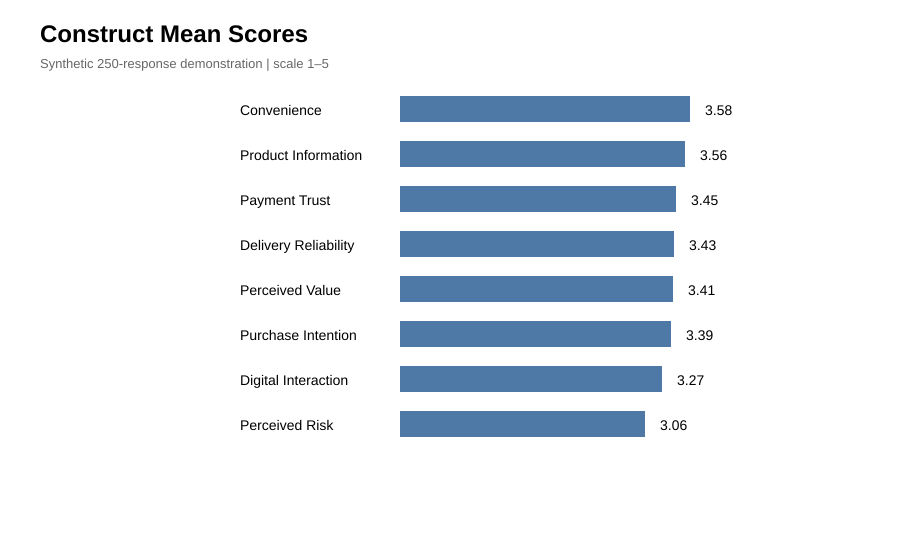
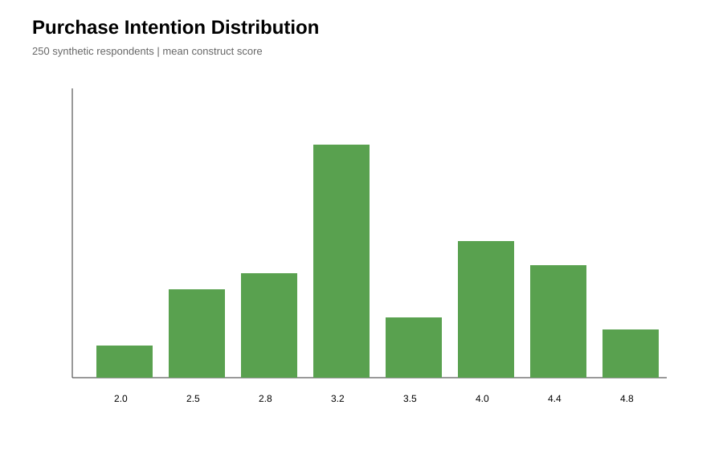
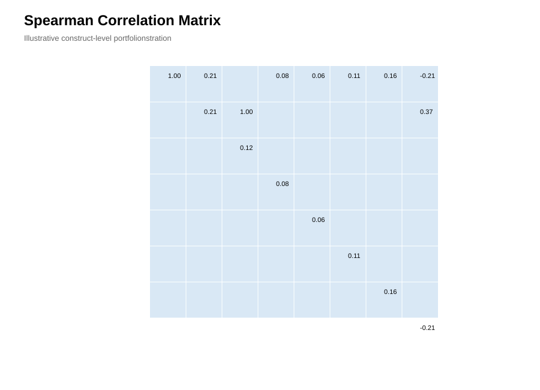
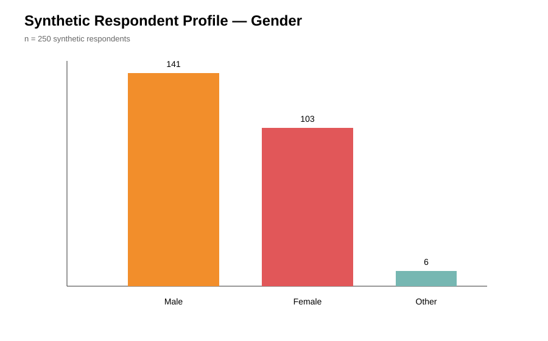
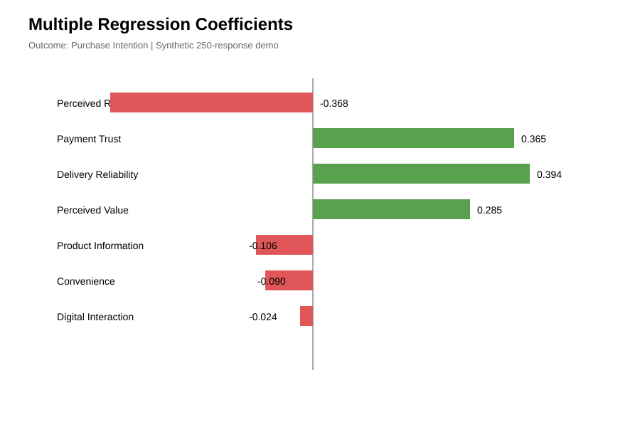

# Factors Influencing Online Purchase Intention Among Pakistani Consumers

**Undergraduate Quantitative Research Project | Pakistani E-commerce Context**

[](docs/methodology.md)
[](https://www.python.org/)
[](data/README.md)

This repository presents a quantitative consumer-behavior and e-commerce research project examining factors associated with **online purchase intention among Pakistani consumers**. The study focuses on perceived risk, payment trust, delivery reliability, product information, convenience, digital interaction, perceived value, and purchase intention.

> **Data note:** The public repository currently uses generated illustrative responses so the complete questionnaire-to-analysis workflow can be inspected. They are not the original respondent records. Replace them with the original anonymized survey dataset before using the repository as the empirical study record.

## Research at a Glance

| Item | Detail |
| --- | --- |
| Research context | Online purchasing among Pakistani consumers |
| Study design | Structured primary questionnaire |
| Portfolio dataset | 250 illustrative responses |
| Research constructs | 8 multi-item constructs |
| Analysis workflow | Reliability, descriptive statistics, Spearman correlation, multiple regression |
| Statistical reporting | Coefficients, p-values, R-squared, adjusted R-squared |

## Research Question

**What consumer and e-commerce factors are associated with Pakistani consumers' intention to purchase products through online channels?**

## Conceptual Framework

**Perceived Risk + Payment Trust + Delivery Reliability + Product Information + Convenience + Digital Interaction + Perceived Value → Online Purchase Intention**

## Research Instrument

The questionnaire contains **40 Likert-scale items** across eight constructs, plus respondent-profile questions.

[Open the research questionnaire](questionnaire/questionnaire.pdf)

## Methodology

1. Define the research problem and constructs.
2. Design the questionnaire and coding framework.
3. Collect and organize respondent-level observations.
4. Check data quality and missing values.
5. Assess internal consistency using Cronbach's alpha.
6. Calculate construct-level descriptive statistics.
7. Examine rank correlations using Spearman's rho.
8. Estimate a multiple regression model for purchase intention.
9. Interpret the statistical results in a consumer-behavior and e-commerce context.
10. Translate the findings into practical implications.

## Statistical Analysis

The current portfolio build contains an illustrative 250-response dataset so the complete workflow can be inspected from raw responses through statistical outputs.

### Reliability
Cronbach's alpha is calculated for each multi-item construct.

### Correlation
Spearman rank correlations are used to examine associations among construct scores and purchase intention.

### Regression
Purchase intention is modeled as the outcome variable with the seven explanatory constructs as predictors. HC3 robust standard errors are used in the Python workflow.

## Findings Reported for the Original Study

The project materials supplied for this portfolio report the following original-study statistics:

- **Trust in payment systems:** beta = **0.41**, *p* < **0.01**
- **Delivery reliability:** beta = **0.33**, *p* < **0.05**
- **Perceived risk:** *r* = **-0.52** with purchase intention

These values are retained as project-reported findings and are kept separate from the illustrative portfolio dataset.

## Visualization Gallery

### Construct Mean Scores
<p></p>

### Purchase Intention Distribution
<p></p>

### Spearman Correlation Matrix
<p></p>

### Respondent Profile
<p></p>

### Multiple Regression Coefficients
<p></p>

[Open the visualization folder](analysis_outputs/visualizations/) · [Open the analysis outputs](analysis_outputs/)

## Repository Structure

- **questionnaire/** - research instrument
- **data/** - variable definitions and data documentation
- **notebooks/** - reproducible Python analysis
- **analysis_outputs/** - statistical report, summary outputs, and figures
- **docs/** - methodology, reproducibility, and CV entry
- **scripts/** - analysis automation
- **requirements.txt** - Python dependencies
- **CITATION.cff** - citation metadata
- **LICENSE** - software license

## Reproducibility

Install the Python dependencies:

```bash
pip install -r requirements.txt
```

Run the analysis script:

```bash
python scripts/run_demo_analysis.py
```

Then open:

`notebooks/purchase_intention_analysis.ipynb`

## Academic Integrity and Privacy

The illustrative portfolio data are clearly separated from the original project findings. Before replacing them with real observations, remove names, emails, phone numbers, exact addresses, student IDs, and other direct identifiers.

## Author

**Ali Raza**
