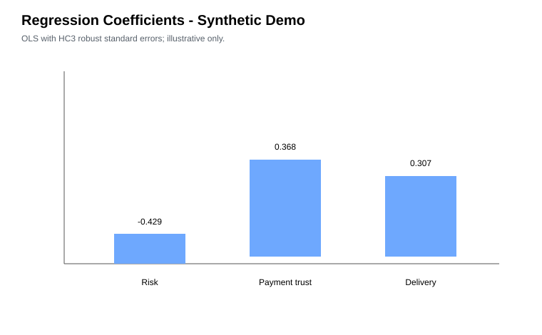
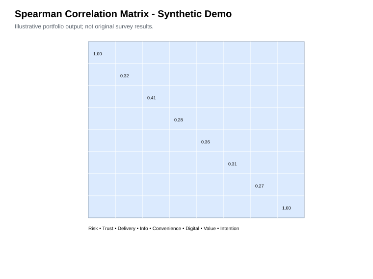
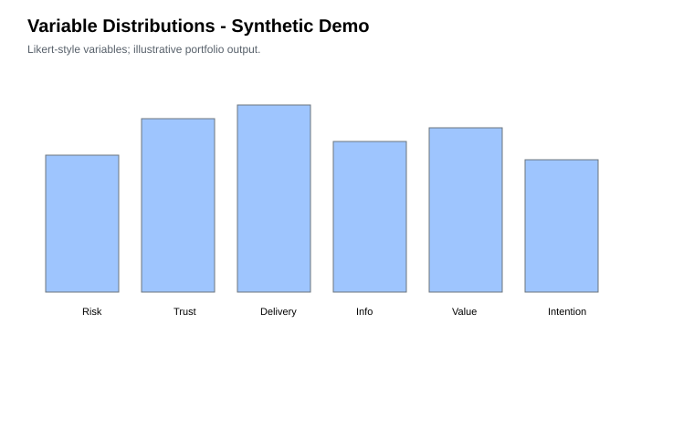
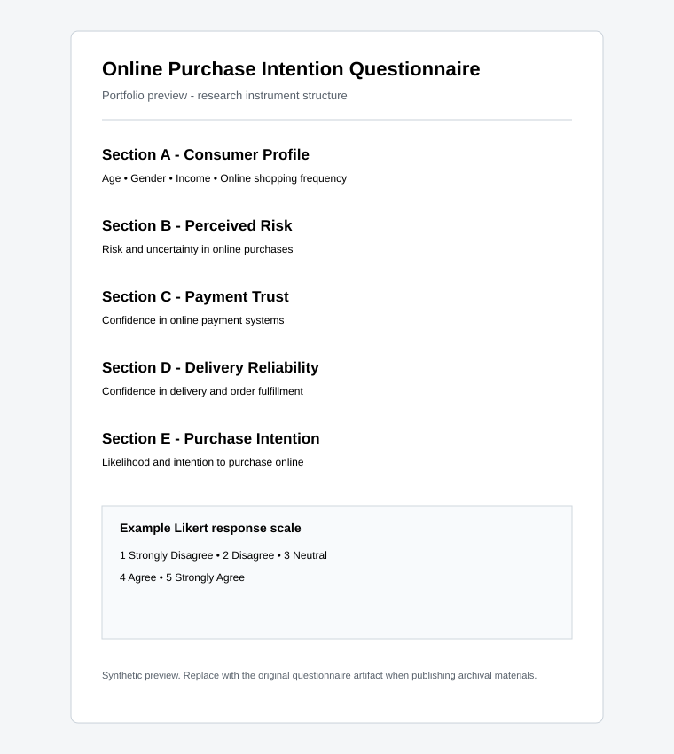

# Factors Influencing Online Purchase Intention Among Pakistani Consumers

**Undergraduate Quantitative Research Project | Pakistani E-commerce Context**

This repository documents an undergraduate research study examining factors associated with **online purchase intention among Pakistani consumers**, including perceived risk, trust in payment systems, delivery reliability, product information, convenience, digital interaction and perceived value.

> **Important - Demo build:** The repository currently contains a **synthetic demonstration dataset and synthetic analysis outputs** so the full project can be viewed and run immediately. These are **not the original respondent records or original empirical results**. Replace the demo CSV with the real anonymized survey dataset before using the repository as evidence of the original study.

## Research at a Glance

| Item | Detail |
| --- | --- |
| Research context | Online purchasing among Pakistani consumers |
| Original study design | Structured primary questionnaire |
| Reported original sample | 250+ respondents |
| Original analysis | SPSS |
| Reported methods | Correlation and regression |
| Current repo mode | Synthetic demo data for reproducibility |

## Research Question

**What consumer and e-commerce factors are associated with Pakistani consumers' intention to purchase products through online channels?**

## Conceptual Focus

Perceived Risk + Trust in Payment Systems + Delivery Reliability + additional consumer/digital factors -> **Online Purchase Intention**

## Methodology

The original study workflow was:

1. Define the research problem and variables.
2. Design a structured consumer questionnaire.
3. Collect and code responses from Pakistani consumers.
4. Clean and organize the respondent-level dataset.
5. Examine correlations among key constructs.
6. Estimate a multiple regression model for purchase intention.
7. Interpret findings in a consumer-behavior and e-commerce context.
8. Translate findings into practical recommendations.

The current public build reproduces the **workflow**, not the original empirical findings.

## Demo Analysis

The included synthetic dataset contains **300 rows** with Likert-style construct variables and a small amount of missingness to demonstrate cleaning. The notebook runs data validation, missing-value checks, Spearman correlations, OLS regression with HC3 robust standard errors, and visualization.

### Regression

### Correlation matrix

### Variable distributions

### Questionnaire preview

Full questionnaire: [questionnaire/questionnaire.pdf](questionnaire/questionnaire.pdf)

## Original Study Findings - Owner Reported

The project materials supplied for this portfolio report:

- **Trust in payment systems:** beta = **0.41**, *p* < **0.01**
- **Delivery reliability:** beta = **0.33**, *p* < **0.05**
- **Perceived risk:** *r* = **-0.52** with purchase intention

These values are preserved as **owner-reported original project results**. They are not reproduced by the synthetic demo analysis.

## Repository Structure

- README.md
- questionnaire/questionnaire.pdf
- data/purchase_intention_data_demo.csv
- data/data_dictionary.csv
- data/README.md
- notebooks/purchase_intention_analysis.ipynb
- analysis/regression_results.pdf
- analysis/demo_results.json
- figures/correlation_matrix.svg
- figures/regression_results.svg
- figures/variable_distributions.svg
- figures/questionnaire_preview.svg
- docs/methodology.md
- docs/reproducibility.md
- docs/research_summary.pdf
- docs/CV_ENTRY.md
- scripts/run_demo_analysis.py
- requirements.txt
- CITATION.cff
- LICENSE

## Run the Demo

pip install -r requirements.txt
python scripts/run_demo_analysis.py

Then open notebooks/purchase_intention_analysis.ipynb.

## Synthetic 250-Response Walkthrough

A fully completed **synthetic** 250-response dataset is included for demonstration. Every respondent has values for all 40 Likert items. The dataset is synthetic and must not be presented as the original study data.

- Demo response dataset: [demo/synthetic_250_responses.csv.gz](demo/synthetic_250_responses.csv.gz)
- Demo analysis report: [demo/analysis_report.md](demo/analysis_report.md)
- Demo analysis summary: [demo/analysis_summary.json](demo/analysis_summary.json)

The conversation package also includes a 250-page visual PDF with each synthetic respondent's questionnaire shown with randomly selected options marked.

## Final Data Visualization Gallery

The complete synthetic 250-response analysis is visualized in [`demo/visualizations/`](demo/visualizations/):

- [Construct mean scores](demo/visualizations/construct_mean_scores.svg)
- [Purchase intention distribution](demo/visualizations/purchase_intention_distribution.svg)
- [Spearman correlation matrix](demo/visualizations/spearman_correlation_matrix.svg)
- [Synthetic respondent profile](demo/visualizations/respondent_gender_profile.svg)
- [Multiple regression coefficients](demo/visualizations/regression_coefficients.svg)
- [Visualization index](demo/visualizations/README.md)

## Replace With the Real Dataset

1. Keep the demo CSV as a reference.
2. Add the anonymized original respondent-level CSV.
3. Map the real column names to the constructs in data/data_dictionary.csv.
4. Rerun the notebook from top to bottom.
5. Replace the synthetic figures/PDF with the reproduced outputs.
6. Remove the demo-only warning only after verification.

Do not upload names, emails, phone numbers, exact addresses, student IDs, or other direct identifiers.

## Academic Portfolio Use

This repository demonstrates experience with quantitative business research, questionnaire-based primary research, consumer behavior, e-commerce research, Python/Pandas data preparation, correlation and regression analysis, statistical interpretation, and evidence-to-recommendation translation.

See docs/CV_ENTRY.md for concise CV wording.

## Author

**Ali Raza**
